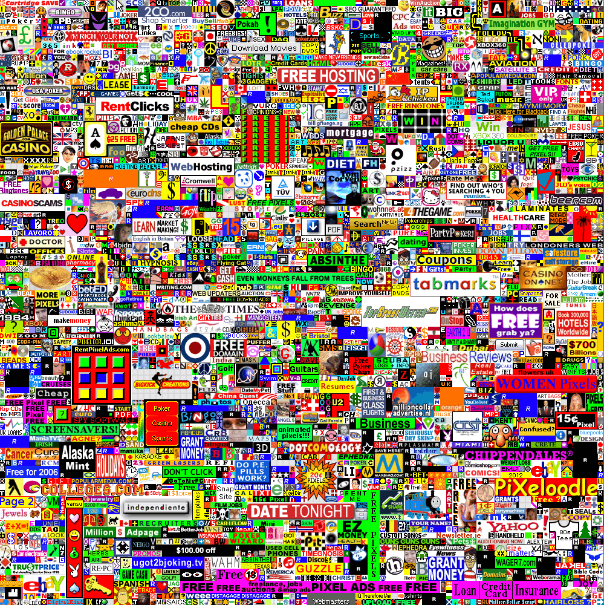

# barcode-matrix

A graphical representation of fixed-length genetic barcodes.
<figure>
    
    <figcaption>
    The million dollar homepage by Alex Tew (2005) - A 1000 x 1000 pixel matrix sold at $1 USD per pixel.
    This matrix approximates the dimensions of a 10-mer barcode matrix.
    </figcaption>
</figure>

## Contents

1. [Mathematical theory](notebooks/theory.ipynb) - A theoretical description of the mathematics of the barcode matrix.
2. [Computational implementation](src/matrix.py) - A computational implementation of the barcode matrix.